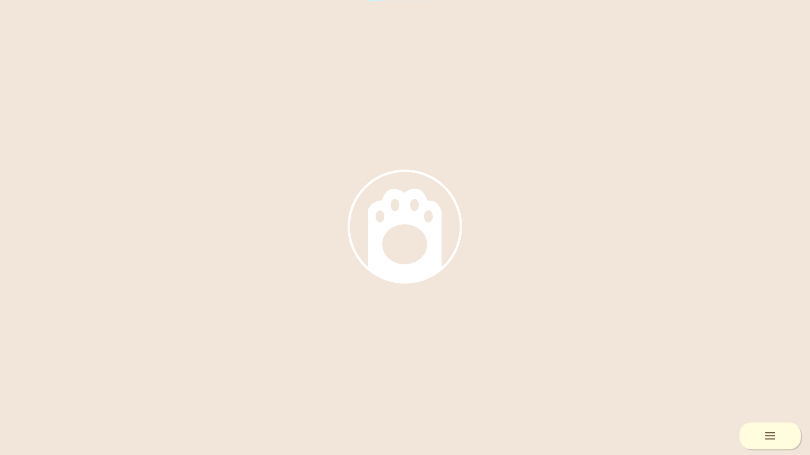
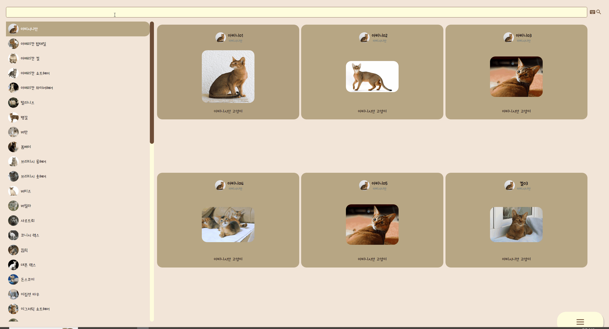
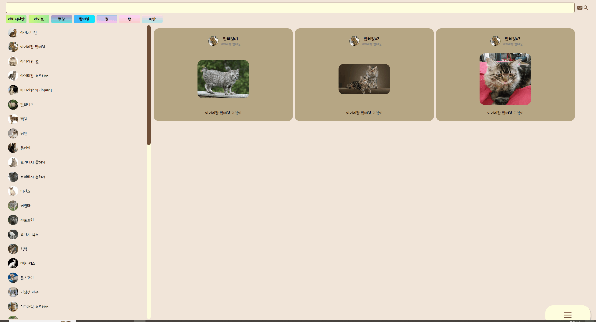
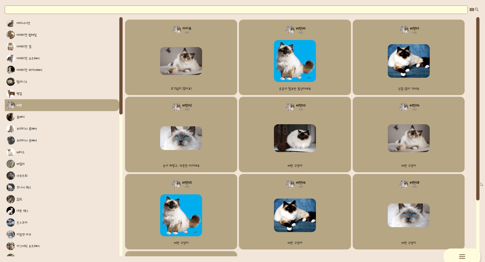
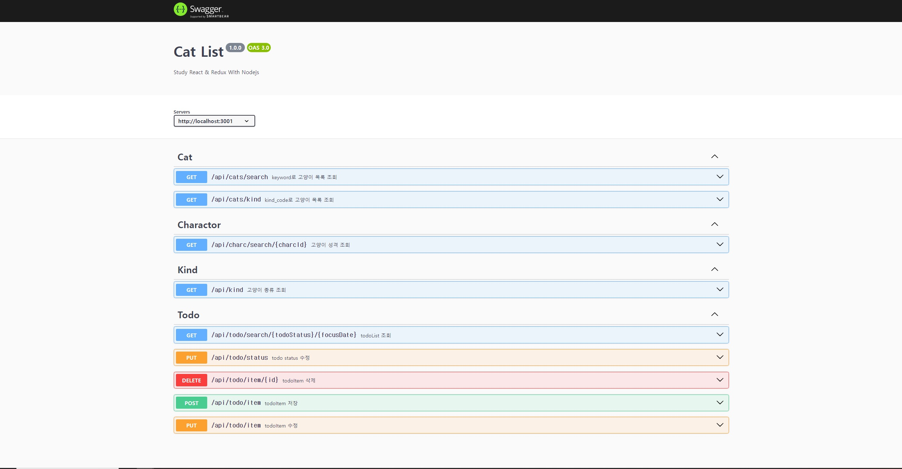

# CatList

**Notion** : 아직 작성 중 입니다. 조금만 기다려주세요 😀


**Front : Vue -> React** 

```
npm install
npm run start
```

**Back : Spring -> Node**

```
npm install
npm run start
```

<Strong>DB : Mysql</strong>


## 개발 배경

**before**

시작은 무한스크롤을 Vue에서 적용해보기 위한 예제.

이제는 추가해보고 싶은 새로운 기능이나 라이브러리등을 하나씩 Vue에 적용해보기 위해 작성해보는 <br/>
개인 공부용 프로젝트.


**after**

React로 마이그레이션 하며, React에서 라이브러리의 적용과 React & Redux의 이해하기위해 연습하는 개인 공부용 프로젝트.


## 주요 기능

* 검색기능
  * 무한스크롤로 추가 조회
  * 조회 시 로딩 UI (Spinner)
  * 고양이 종류 목록 클릭으로 리스트 조회.
  * 검색 후 최근 검색어 태그 추가 (태그 클릭으로 조회)
  * 가상키보드를 이용한 검색창 입력

* 고양이 detail정보
  * 성격 차트
  * 위치 지도 출력.

* TodoList (CRUD)
* TipTap
* Swagger 작성


## 실행화면

### Opening Page




### 목록 페이지

### 무한 스크롤 및 로딩 UI 


### 검색 및 검색어 태그상자 추가




### 가상 키보드




### 메뉴




### TodoList


### TipTap


### Swagger


