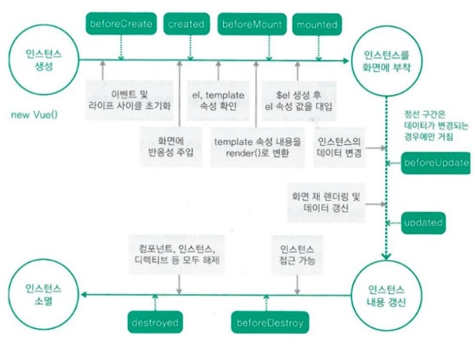

# Infinite-Scrolling

Vue로 작성한 무한스크롤 예제

<strong>Front : Vue </strong>

```
npm install
npm run serve
```

<strong>Back : Spring</strong>

```
Run application
```

<Strong>DB : mysql</strong>


## 주요기능

* 무한 스크롤 (완료)
* detail 정보 띄우기 (vuex, props이용.) (완료)
* 다크 모드 (완료)
* 데이터 로딩 UI (완료)
* 검색 기능. (완료)
* 검색 후 최근 검색어 태그 추가. (완료)
* 차트 추가 (완료)
* 위치 지도로 출력 (완료)
* 원형 스타일의 메뉴(완료)
* 사이트 방문 수 차트페이지 (완료)
* 음성인식으로 검색창 입력.(진행중)
* TodoList (진행중)


---


## 무한스크롤 로직

```vue
data(){
   return{
  	cats:[],
    start:0,
    limit:6,
    isLoading:true,
   }
 },
```

* axios통신으로 목록을 받아와 cats에 추가.
* 시작할지점을 나타내는 start
* 불러올 목록의 개수 limit
* 더 불러올 데이터가있다면 isLoading을 true, 없다면 false로.


```vue
created(){
  this.append_list();
  window.addEventListener('scroll', this.scroll);
},
```

<strong>처음 생성 될 때 , 처음 보여질 목록을 추가. </strong>

* append_list()함수 동작
* scroll 이벤트를 추가함.


```vue
scroll(){
    let scrolledToBottom =
      document.documentElement.scrollTop + window.innerHeight ===
      document.documentElement.offsetHeight;
      console.log(this.isLoading);

      if(this.isLoading && scrolledToBottom){
        this.isLoading = true;
        setTimeout(this.append_list, 1000);
      }
  },
```

<strong>scroll() 메서드</strong>

* scrolledToBottom은 스크롤이 가장 바닥인지 저장하는 변수.

* scrollTop과 보이는 window의 높이를 더한게 전체 높이랑 같으면 True, 아니면 False.


만약 scroll이 가장 아래에 있고, 더 로딩할게 있다면(isLoading = true) 1초 후 <strong>append_list()</strong>동작.

(추후 이 1초 사이에 로딩화면 추가할 예정.)


```vue
append_list(){
    http.get(`/cats/${this.start}`).then((response)=>{
      if(response.data.length>=6){
        this.isLoading = true;
            for(var i=0;i<6;i++){
                this.cats.push({
                cat_name: response.data[i].cat_name,
                cat_num: response.data[i].cat_num,
                create_date: response.data[i].create_date,
                description: response.data[i].description,
                kind: response.data[i].kind,
                profile: response.data[i].profile
            },
        );
        }
        this.start += this.limit
        console.log(this.start);
      }
      else{
       for(i=0;i<response.data.length;i++){
            this.cats.push({
                cat_name: response.data[i].cat_name,
                cat_num: response.data[i].cat_num,
                create_date: response.data[i].create_date,
                description: response.data[i].description,
                kind: response.data[i].kind,
                profile: response.data[i].profile
            },
            );
        }
        this.start += this.limit
        console.log(this.start);
        this.isLoading=false;
      }
    }).catch(()=>{
      alert('정보를 받아오는데 실패!');
    })
  }
},
```

<strong>append_list()</strong>

* axios통신을 통해 받은 목록을 cats에 push함.
* push 후  ' this.start += this.limit '를 통해 스크롤 했을 때 다음 데이터의 시작점을 바꿔줌.
* 만약 받은 data의 길이가 limit보다 작다면 isLoading을 false로 바꾸고 더 이상 data를 받지 않는다.

---


## 다크모드

```vue
export default new Vuetify({
    theme: {
        dark:true
    }
});
```

<strong> 먼저 vuetify 플러그인 파일 (plugin/vuetify.js)에 dark모드를 사용한다고 설정.</strong>


```vue
// 로컬 스토리지에 변수 값 확인.
const theme = localStorage.getItem('dark_theme');
```

로컬 스토리지에 변수 'dark_theme'의 값을 확인 후

```vue
 this.$vuetify.theme.dark
```

dark_theme에 따라 위의 값을 설정해줌.


```vue
window.matchMedia('(prefers-color-scheme: dark)').matches
```

만약 dark_theme이 존재 하지 않는다면, 시스템에서 다크모드를 활성화 했는지 확인 하고, 활성화 되었다면   this.$vuetify.theme.dark를 true로 설정.

그리고 <strong>localStorage에 'dark_theme'을 저장</strong>한다.


```vue
<button class="darkBtn" @click="changeDark">다크모드</button>


methods:{
    changeDark() {
                // console.log('dark : ' + this.$vuetify.theme.dark.toString());

                this.$vuetify.theme.dark = !this.$vuetify.theme.dark;
                localStorage.setItem('dark_theme', this.$vuetify.theme.dark.toString());
            },
}
```

버튼을 만들고 버튼 클릭 시 마다 <strong>this.$vuetify.theme.dark</strong>의 상태를 바꿔주고,  **localStorage에 'dark_theme'을 저장**


참고 :

* https://velog.io/@yijaee/%EB%8B%A4%ED%81%AC%EB%AA%A8%EB%93%9C-%EA%B5%AC%ED%98%84%ED%95%98%EA%B8%B0
* https://marshall-ku.com/web/tips/%EC%9B%B9%EC%97%90%EC%84%9C-%EB%8B%A4%ED%81%AC-%EB%AA%A8%EB%93%9C-%EA%B5%AC%ED%98%84%ED%95%98%EA%B8%B0
* https://hkamran.medium.com/using-local-storage-to-store-vuetifys-dark-theme-state-6158786449c
* https://developer.mozilla.org/ko/docs/Web/CSS/@media/prefers-color-scheme
* https://developer.mozilla.org/ko/docs/Web/API/Window/matchMedia

---


## 로딩 UI

```vue
<div class="loadingBox" v-if="loadingFlag">
    <v-img
           :src="require(`@/assets/images/Loading_cat.gif`)"
           class="loading"
           ></v-img>
</div>
```

먼저 loading하면 뜰 화면을 작성.

<strong>loadingFlag를 통해 로딩 될 때 해당 부분이 보이도록 한다.</strong>


```vue
if (this.isLoading && scrolledToBottom) {
                this.isLoading = true;
                this.loadingFlag = true;
                console.log('loading : ' + this.loadingFlag);
                setTimeout(this.append_list, 3000);
            }
```

true가 되는 지점은  scroll메서드에서 append_list가 발생하기 전!

loading화면을 확인하기 위해 setTimeout으로 append_list가 3초뒤에 발생하게 설정함.

```vue
append_list() {
            http.get(`/cats/${this.start}`)
                .then((response) => {
                    if (response.data.length >= 6) {
                        ...
                    } else {
                        ...
                    }
                    this.loadingFlag = false;
                })
                .catch(() => {
                    alert('정보를 받아오는데 실패!');
                });
        },
```

그리고 axios통신이 끝날 때 false로 되돌린다.


참고 : 

* https://developer.mozilla.org/ko/docs/Web/API/WindowOrWorkerGlobalScope/setTimeout

* https://velog.io/@yejinh/Intersection-Observer%EB%A1%9C-Lazy-Image-%EA%B5%AC%ED%98%84%ED%95%98%EA%B8%B0
* https://helloinyong.tistory.com/297
* https://www.codingfactory.net/11943

---


## 태그 추가

```vue
<v-row>
    <div
         v-for="(keyword, index) in writing"
         :key="index"
         class="keywordBox"
         @click="chooseKeyword(keyword)"
         >
        {{ keyword }}
        <div class="deleteBox" @click="deleteKeyword(index)">X</div>
    </div>
</v-row>
```

검색 버튼 클릭 시 this.keyword를 writing 배열에 넣고, 검색창 아래에 v-for로 writing 배열을 반복해 div를 추가한다.


```vue
deleteKeyword(index) {
            this.writing.splice(index, 1);
        },
```

삭제(x버튼)를 클릭 시 해당 idx를 가지고, splice를 통해 배열에서 값을 삭제함.


```vue
 bgName: [
          'warmFlame','nightFade', 'springWarmth', 'sunnyMoring', 'rainyAshville', 'frozenDreams', 'dustyGrass',~~
		]

randomBackground() {
            let randomIdx = Math.floor(Math.random() * this.bgName.length);
            console.log('randomIdx : ' + randomIdx);
            let color = this.bgName[randomIdx];
            console.log('randomIdx : ' + color);
            let keywordBox = document.querySelector('.keywordBox:nth-child(' + this.idx + ')');

            console.log(keywordBox);
            keywordBox.classList.add(color);
        },
```

색상 클래스명을 작성한 배열을 만들고 randomIdx로 랜덤변수를 만들어 keywordBox에 랜덤으로 클래스명을 추가한다.


참고:

* https://developer.mozilla.org/ko/docs/Web/API/Document/querySelector
* https://developer.mozilla.org/ko/docs/Web/API/Element/classList

---

## 차트

Chart.js를 이용하여 고양이의 성격을 그려주는 차트.

추후에는 db에서 받아서 그래프를 그려줄 예정.

```vue
<div style="background-color: #fbceb1; height: 500px">
    <canvas :id="id" height="250px" width="250px"></canvas>
</div>
```

먼저 그래프가 그려줄 영역지정.

```vue
import Chart from 'chart.js';

data(){
    return{
    	catData: {
                labels: [
                    'Eating',
                    'Drinking', ......
                ],
                datasets: [
                    {
                        label: 'My First Dataset',
                        data: [65, 59, 90, 81, 56, 55, 40],
                        fill: true,
                        backgroundColor: 'rgba(255, 99, 132, 0.2)',
                        borderColor: 'rgb(255, 99, 132)',
                        pointBackgroundColor: 'rgb(255, 99, 132)',
                        pointBorderColor: '#fff',
                        pointHoverBackgroundColor: '#fff',
                        pointHoverBorderColor: 'rgb(255, 99, 132)',
                    },
                ],
		},
	}
}
```

dataset의 label에 항목들을 적어주고, dataset의 data에 값을 넣어준다.


```vue
mounted() {
        this.createChart();
    },

-----------------------------------------------------------------------------

createChart() {
            const ctx = document.getElementById(this.id);
            console.log(ctx);
            // 그려질 그래프 설정.
            this.chartObject = new Chart(ctx, {
                type: 'radar',
                data: this.catData,
                options: this.options,
            });
        },
```

createChart메소드에서 그려질 그래프를 그린다.

* type은 그려질 그래프 종류
* data는 들어갈 data.
* option은 설정한 option 이 적용된다.


참고 : 

* https://www.chartjs.org/docs/latest/
* https://www.chartjs.org/docs/2.9.4/
* https://github.com/chartjs/Chart.js/issues/3715
* https://hyeooona825.tistory.com/40
* https://m.blog.naver.com/PostView.nhn?blogId=jjoommnn&logNo=221082930638&proxyReferer=http:%2F%2F211.63.177.133%2F

---

## 구글API를 이용해 위치 지도로 출력하기.

구글 api를 설정하고, 위치정보를 저장한 address table을 가져와야함.

기존에 고양이정보를 가져올 때 같이 가져오게 변경.

```sql
[listCats]
select * 
from cat 
limit #{start},6 을

select * 
from cat join address on cat.cat_num = address.cat_num 
limit #{start}, 6
로 변경
-----------------------------------------------------------------------------------------------------------------------------
[searchCats]
select * 
from cat 
where cat_name LIKE CONCAT ("%", #{cat_name}, "%"); 을

select * 
from cat join address on cat.cat_num = address.cat_num 
where cat_name LIKE CONCAT("%", #{cat_name}, "%");
로 변경
```


npm에서 vue2-google-map 이용

```
npm install vue2-google-maps
```

main.js추가.

```
import * as VueGoogleMaps from 'vue2-google-maps';

Vue.use(VueGoogleMaps, {
    load: {
        key: 'your api key',
        libararies: 'places',
    },
});
```


mapBox 추가

```vue
<div class="mapBox">
    <GmapMap
    class="map"
    ref="mapRef"
    :center="center"
    :zoom="15"
    >
		<GmapMarker :position="position" />
	</GmapMap>
</div>
```

hover시에만 mapBox가 나타나게 하고,  그 때 position과 center를 정해준다.

```vue
setCenter(idx) {
    this.position.lat = this.cats[idx].lat;
    this.position.lng = this.cats[idx].lng;
    this.center = this.position;
},
```

참고 : 

* https://www.npmjs.com/package/vue2-google-maps
* http://daddynkidsmakers.blogspot.com/2020/01/google-map-vuejs.html


---

## 방문 수 증가

```text
페이지 방문함. -> 오늘 첫방문인지확인 -> 첫방문이면 새로 오늘날짜로 추가.
			 -> 아니면 오늘 날짜 찾기 -> 찾은거 방문수 1up
			 
필요한 method
----------------------------------------------------------------------

차트보는 페이지 드갈 떄 사용

전체 조회1개

----------------------------------------------------------------------

새로고침마다 쓸거.

[back에서]
조회하는거 1개 (전체를 돌면서 오늘 날짜 있는지 찾음) - 해당 id리턴, 없으면 0리턴.  
id가 0이면(없으면) - create
id가 양수면(있으면) -  update

[수정]
전체조회 후, 리스트저장하고, front에서 처리.

날짜가 없으면 - create
날짜가 있으면 - 해당 id로 update

id가 양수면(있으면) -  update
----------------------------------------------------------------------
```


무조건 Front처리가 좋은걸까?

무조건은 아니다.
예를 들어 validation check는 프론트에서 할 수 있지만, '사용자 편의''를 위한 거지 데이터의 validation을 완벽히 체크할 수 없는거다.

어떻게든 우회해서 변조된 데이터를 넘길 수 있기 때문에 validate를 통과시키고 이상한 겂을 넣을 수 있기 때문에 서버에서 다시 막아줘야한다.

즉, 프론트에서 처리하는건 '사용자 편의'를 위한 것. 

프론트에서 했으니 됐겠지라고 생각하고, 프론트에서만 처리해버리는거만 아니면 왠만해선 프론트에서 하는게 좋을 수 있다.


---

## 진행상황

<strong>v1.0</strong> : 고양이 목록을 스크롤 시 1초 후 계속 추가해나가 무한 스크롤 동작.

<strong>v1.1</strong> : 

- 고양이 카드를 클릭 시 vuex에 그 정보를 저장하고, modal창으로 정보를 출력함.
- modal창은 component로 구분하였고, props를 통해 dialog를 주고받음.
- modal창의 정보는 vuex를 이용하여 출력해보았음.

<strong>v1.2 :</strong>

* 처음에 dark클래스를 토글하는 방식으로 적용.
* 원하는 대로 잘 적용 되지 않음.
* vuetify에서 제공하는 darkMode를 적용함.

<strong>v1.3 : </strong>

* append_list()가 동작하기 전 후로 flag를 변경시켜 화면을 노출시키려고 함.
* loading화면을 보기위해 append_list를 3초뒤에 동작하게 setTimeout을 이용.
* console로 찍었을 때 flag는 변화하지만, 화면은 노출되지않음.
* flag를 false로 바꾸는 지점을 axios통신이 끝날 때로 변경.

<strong>v1.4 :</strong>

* 검색한 키워드(고양이 이름)를 받아 해당 이름의 고양이 카드 리스트를 받아옴.
* 기존의 cats배열을 빈 배열로 시키고, 받은 데이터를 다시 넣음.
* 검색 동안 로딩UI가 뜨게 변경
* 해당 이름검색을 LIKE를 이용해 keyword가 포함된 아이들 다 검색.
* 검색 후 키워드를 초기화시켜 placeholder가 보이게 하고, 스크롤이 내려가면 다음 목록이 출력되는 현상 막음.
* 참고 : https://developer.mozilla.org/ko/docs/Web/JavaScript/Reference/Global_Objects/Array/concat

<strong>v1.5 : </strong>

* 검색한 키워드를 검색창 아래에 태그를 추가함.
* 5개까지 추가가 되며 5개가 넘어가면 처음 게 지워지고, 가장 맨뒤에 추가됨.
* 태그 클릭 시 검색창에 값이 입력되고, x클릭 시 사라짐.
* 이미 있는 태그를 검색 시 이미 존재하는 태그를 지우고, 가장 맨 뒤에 추가가 됨.
* 추가 시 태그의 배경색을 랜덤으로 적용.

<strong>v1.6 :</strong>

* 고양이의 성격에 대한 차트를 상세정보창에서 보여준다.
* 이 때 값은 고정된 데이터로 chart.js를 사용해 그릴 수 있는지만 확인 함.
* 데이터를 받아오려면 db의 수정이 필요해 보임.
* 3.1.0 version에서 에러가 발생해 2.9.4로 재설치.
* created에서 createChart했을때 오류 발생하여 mounted에서 동작. 

<strong>v1.7 : </strong>

* 고양이의 위치를 저장한 Address table의 정보를 가져와 google api를 이용해 출력한다.
* back부분에서 cat정보만 들고 오던거를 JOIN을 이용하여 그 고양이의 address정보까지 가져옴.

<strong>v2.0 :</strong>

* 오프닝 페이지 추가.
* opacity를 0 -> 1 로바꾸면서 등장하는 효과를 냄.
* search부분 호버시 색 변화.

<strong>v2.1 : </strong>

* 원형 스타일의 메뉴 추가 -> 리스트형태로 변경 예정.
* 아이콘 추가.
* 다크모드버튼 메뉴안으로 이동.
* 스타일 수정(예정)

<strong>v2.2 :</strong> 

* 방문차트 페이지 추가.
* 방문 차트 그리기.
* 첫 방문 시 새로 data를 create, 아니면 update함.

<strong>v2.3 음성인식으로 검색 : </strong>

* props를 이용해 dialog on/off.
* 음성인식 코드 작성.
* ~~마이크 고장으로 인한 정확한 확인 불가~~
* 마이크 인식 확인.
* 말할 때마다 추가되지 않고, 한 p태그안에서 내용만 바뀌게 변경
* dialog를 닫을 때 keyword에 바로 입력되게 하기.

<strong>v2.4 TodoList :</strong>

* v-calendar, v-tab을 이용한 todolist.
* vue파일에서 axios통신이 완료되면 vuex로 옮길 예정.
* TodoList가 완료되면, 리팩토링과 README를 노션으로 옮기거나 기능별로 나눠서 정리할 예정.

## Issue 및 Error
<strong>v1.0 무한스크롤 </strong>

* 처음 cats에 바로 받아온 data를 넣었더니, 스크롤 시 데이터들이 쌓이는게 아니라, 6개만 게속 보여줌.
즉, 처음에 0번째 ~ 5번째까지 데이터를 cats에 넣었다면, 스크롤 했을 때 6번째 ~ 11번째까지가 다시 cats에 들어가서 6번째 ~ 11번째 데이터만 보임.
그래서 cats에 바로 data를 넣지 않고, push를 이용하여 계속 데이터를 추가해나감.


* 다시켰을떄 서버와 Vue를 실행시키고 목록을 받는과정에서 Access Denied for User 'root'@'localhost' (using password: YES) 발생

```
git에 올리면서 application.properties에 'write your user name' 이부분을 ''를 안지우고 적어 발생.


만약 다른경우에 생긴다면 권한이 없다는 문제. or id나 pw를 잘못 입력한경우.
GRANT ALL PRIVILEGES ON *.* TO 'username'@'localhost' IDENTIFIED BY 'PASSWORD' WITH GRANT OPTION;
```


---

<strong>v1.1 상세정보 띄우기</strong>

```vue
모달창을 클릭하고 닫을 때 Vue warn발생.
[경고 내용]
Avoid mutating a prop directly since the value will be overwritten whenever the parent component re-renders.

[원인]
하위 컴포넌트(CatsDetail.vue)에서 부모에서 받은 data를 직접 변경하려 해서 경고 발생.
CatsDetail.vue
closeDetail() {
    		this.detailDialog = false;
            this.$emit('closeDetail', this.detailDialog);
        },
         

[해결]
detailDialog를 하위에서 바꾸지않고, 그대로 detailDialog를 상위로 보내 상위 컴포넌트에서 처리.
CatsDetail.vue
closeDetail() {
    		this.detailDialog = false;
            this.$emit('closeDetail', this.detailDialog);
        },

Main.vue
closeDetail(detailDialog) {
            this.detailDialog = !detailDialog;
        },

```

추가로, watch에서 val뿐만 아니라 openDetail과 closeDetail까지 보고있어서 값을 바꾼 후 한번 더 바꾸는 걸 확인함.

그래서 watch에서 지켜보는걸 삭제하였음.


---

<strong>v1.2 다크모드</strong>

dark클래스를 추가했다가 제거하는 방식으로 토글하려고 했는데 전체 적용이 되긴하지만, 카드 내용이 적용되지않았음.

그래서 방법을 찾던 중 vuetify에서 제공하는 dark모드가 있는 것을 확인.

적용은 되었지만, 새로고침시 유지가 되지않음.

```vue
[해결]
처음에 localStorage에서 dark_theme의 변수 값을 확인하고, 그에 따라 dark모드를 적용.
만약 존재하지 않는다면, 시스템에서 다크모드가 활성화 되었는지 window.matchMedia('(prefers-color-scheme: dark)'를 통해 확인 후 dark모드 설정함. 
```


---

<strong>v1.3 로딩 UI</strong>

처음 setTimeout(this.append_list, 3000); 전후로 true, false를 뒀는데 <strong>loadingFlag의 값은 변하지만, 화면에는 뜨지는 않았다.</strong>

```
[원인]
setTimeout은 타이머가 만료된 뒤 함수나 지정된 코드를 실행하는 타이머를 설정한다.
그래서 loadingFlag를 true로 바꾸자마자 바로 false로 바꾸고, 3초뒤 append_list가 동작 한 것 같다.

[해결]
flase로 바꾸는 지점을 append_list에서 데이터를 push하고, 끝날 때로 변경해서 해결하였다.
```


### infinite scroll을 사용하면 자동 lazy image loading이 되는 것 아닐까?

처음에 검색하다보니 lazy loading에 대한게 많이보여서 찾아봤었다.

제목처럼 저런 의문이 들었고,

https://velog.io/@yejinh/Intersection-Observer%EB%A1%9C-Lazy-Image-%EA%B5%AC%ED%98%84%ED%95%98%EA%B8%B0의 예를 통한 설명을 보고 
다르다는 것을 알았다.

```
예를 들어 스크롤 이벤트를 통해 한번에 50개씩 데이터를 받는다고 할 때, 
50개씩 데이터 요청 하는 것이 infinite scroll로, 응답된 50개의 이미지를 바로 그리지 않고 
화면 상에 보여질 차례가 되었을 때 그리는 것이 lazy image loading 인 것이다.
```

검색 기능 구현이 끝나면 lazy loading의 구현과 공부해보자.


---

<strong>v1.4 검색</strong>

```
org.apache.ibatis.executor.ExecutorException: A query was run and no Result Maps were found for the Mapped Statement 'com.ssafy.cats.model.dao.CatsDAO.searchCats'.  It's likely that neither a Result Type nor a Result Map was specified.

[해결] mybatis에서 resultType을 명시하지않아 발생.
```


sql문 xml을 사용할 때

```
select * from cat where cat_name LIKE ...
```

LIKE뒤에 #{cat_name}을 어떻게 써야할지 몰랐었음.

'%#{cat_name}%'을 하면 #{cat_name}자체 글자가 있는지 없는지 검색하게 됨.

https://developer.mozilla.org/ko/docs/Web/JavaScript/Reference/Global_Objects/Array/concat를 참고.

```
[해결]
concat을 이용.
concat은 메서드를 호출한 배열 뒤에 각 인수를 순서대로 붙여 새로운 배열을 만듭니다
인수가 배열이면 그 구성요소가 순서대로 붙고, 배열이 아니면 인수 자체가 붙습니다.

select * from cat where cat_name LIKE CONCAT("%", #{cat_name}, "%");
```


검색 후 스크롤이 내려가면 다음 목록을 가져오는 현상이 발생.

```
[해결]
검색이 끝나는 지점에서 isLoading의 상태를 false로 두어 더 검색되지 않게 함.
추가로 검색창에 값이 남아있어 초기화도 시켜둠.
```


---

<strong>v1.5 검색어 태그</strong>

태그가 5개일 때 값 중복체크 시 제대로 삭제되지않고 추가되지않음.

```vue
[해결]
same flag를 두어 만약 중복값을 찾으면 same을 true로 변경.
same이 true면 중복값을 이미 찾아서 지우고 추가하는 작업을 했다는 뜻.
false면 겹치는게 없어 처음 값을 지우고 새로운 값을 추가하는 작업을 동작함.

else if (this.writing.length == 5) {
                let same = false;
                for (i = 0; i < this.writing.length; i++) {
                    if (this.keyword == this.writing[i]) {
                        this.writing.splice(i, 1);
                        this.writing.push(this.keyword);
                        same = true;
                        break;
                    } // if
                } // for
                if (same == false) {
                    this.writing.splice(0, 1);
                    this.writing.push(this.keyword);
                } // if
            } //else if
```


로딩화면을 보기위해 searching에 setTimeout을 걸어놔서 랜덤으로 배경을 추가할 때 class를 못찾는 에러가 발생.

아마도 searching이 발생하고, 배열에 값이 들어간 후 tag가 만들어지는데 이거를 로딩화면 보겠다고 3초뒤에 실행하게 해서

randomBackground가 먼저 실행되어 그런 거 같다.

randomBackground에도 setTimeout을 주어 정상작동. 하지만 수정이 필요할 거 같다.

```
 setTimeout(this.searching, 3000);
 setTimeout(this.randomBackground, 3100);
```


클래스명이 keywordBox인 친구를 찾아서 random으로 배경을 적용.

배경은 css에 미리 만들어 vue파일에서는 클래스명이 적힌 배열을 만들어, 배열명을 랜덤으로 뽑아서 클래스명으로 추가하는 방식.

끊임없이 클래스명이 추가가되버림.

```vue
randomBackground() {
            let keywordBox = document.querySelector('.keywordBox:nth-child(' + this.idx + ')');
            keywordBox.className = 'keywordBox';

            let randomIdx = Math.floor(Math.random() * this.bgName.length);
            console.log('randomIdx : ' + randomIdx);
            let color = this.bgName[randomIdx];
            console.log('randomIdx : ' + color);

            console.log(keywordBox);
            keywordBox.classList.add(color);
        },
        
[해결중]
클래스명을 추가하기전 className = 'keywordBox'로 하나로 초기화한다음 추가시킴. (원하는대로 동작이 안되 수정 필요해보임)
```


---

<strong>v1.6 성격 그래프</strong>

그냥 install했을 때 version이 3.1.0이였고, export에러가 발생.

```
"export 'default' (imported as 'Chart') was not found in 'chart.js'

[해결]
version을 2.9.4로 변경.
npm install chart.js@2.9.4
```


그 후 계속 다음 에러가 console에서 발생

```
vue.runtime.esm.js?2b0e:619 [Vue warn]: Error in created hook: "TypeError: Cannot read property 'length' of null"
```


```
[해결]
created(){
	this.createChart();
}
를

mounted(){
	this.createChart();
}
로 변경.
```

Vue의 생명주기와 관련된 문제 같았다.

https://github.com/chartjs/Chart.js/issues/3715 여기서

```
"do not put the chart in created .....just put it in mounted .
it just about the timing."
```

라는 댓글을 보고, created되있던걸 mounted에서 동작하게 변경하였다.

Mounted는 rendering이 되고나서, trigger되지만, created는 rendering전에 trigger되기 때문이라고 한다.


**VueLifeCycle**



참고 :

https://hyeooona825.tistory.com/40

https://m.blog.naver.com/PostView.nhn?blogId=jjoommnn&logNo=221082930638&proxyReferer=http:%2F%2F211.63.177.133%2F


데이터를 받아올 때 props를 사용 했지만, 계속 data가 undefined가 출력됐었다.

```vue
[해결]
Main.vue에서 부터
Main.vue >> CatsDetail.vue >> Character.vue로 데이터를 자식이 받는데, CatsDetail.vue와 Character.vue끼리는 바인딩을 했지만,
Main.vue와 CatsDetail.vue사이에 바인딩을 해주지 않았다.
그래서 계속 undefined가 발생.

 <catsDetail
 	:detailDialog="detailDialog"
 	:charc="charc"
 	@closeDetail="closeDetail"
 ></catsDetail>
 
 <character :id="'cat' + catsDetail.cat_num" :data="charc"></character>

추가적으로 props할때 소문자만 사용할 것을 권장한다고 한다.
```


---

**v1.7 구글api로 지도 나타내기**

참고:

* https://www.npmjs.com/package/vue2-google-maps
* http://daddynkidsmakers.blogspot.com/2020/01/google-map-vuejs.html


---

<strong>v2.0 오프닝 페이지 추가</strong>

```css
.blinking {
    -webkit-animation: blink 1.5s ease-in-out 1 alternate;
    -moz-animation: blink 1.5s ease-in-out 1 alternate;
    animation: blink 1.5s ease-in-out 1 alternate;
}

@-webkit-keyframes blink {
    0% {
        opacity: 0;
    }
    100% {
        opacity: 1;
    }
}
```

animation효과로 처음 페이지가 켜질때 등장하는 효과 넣음.


<strong>v2.1 메뉴버튼 추가 </strong>

translate를 이용해 원형 메뉴를 추가함.

```html
<input type="checkbox" href="#" class="menu-open" name="menu-open" id="menu-open" />
<label class="menu-open-button" for="menu-open">
    <span class="lines line-1"></span>
    <span class="lines line-2"></span>
    <span class="lines line-3"></span>
</label>
<div class="menu-item blue"></div>
<div class="menu-item orange"></div>
<div class="menu-item lightblue"></div>
```

```css
.menu-open:checked ~ .menu-item:nth-child(3) {
    transition-duration: 180ms;
    -webkit-transition-duration: 180ms;
    -webkit-transform: translate3d(-90.86291px, 52.62064px, 0);
    transform: translate3d(-90.86291px, 0.62064px, 0);
}
```

menu-open이 체크되있을 때 3번째 menu-item의 위치를 변경시킴.

~연산자는 A ~ B 일 때 A가 앞에 존재하면 B를 선택합니다.
A가 B보다 먼저 등장하지않으면 선택X


---

<strong>v2.2 방문 차트 추가 </strong>

처음엔 페이지에 들어갔을 때 그냥 전체 데이터를 조회하는거 1개.

오늘 날짜가 처음인지 아닌지 확인을 위한 메소드, create, update 총 4개를 만들려고 했는데.

오늘 날짜가 처음인지 아닌지 확인 하는게 결국 전체 데이터를 조회해서 오늘 날짜를 비교하면 되니 굳이 만들 필요가 없었다.


방문페이지에 들어가면 차트가 그려지지만, 새로고침 시 데이터가 유지가 되지않았다.

watch로 createChart하는 data를 하니 유지가 되었다.

```vue
watch: {
    data() {
    	this.createChart();
    },
},
```


---

<strong>v2.3 음성인식으로 검색</strong>

