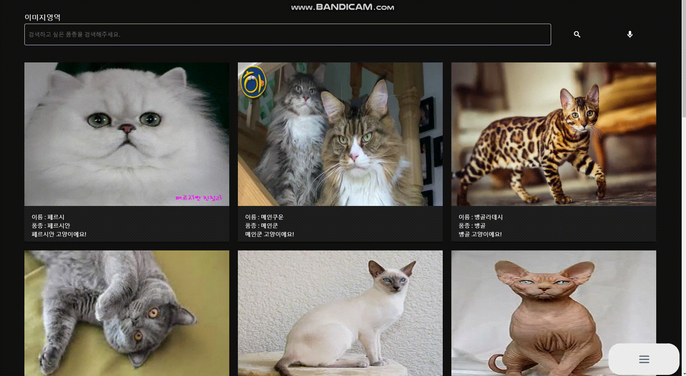
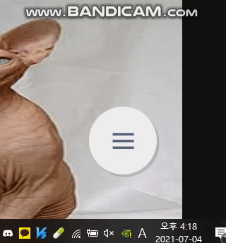
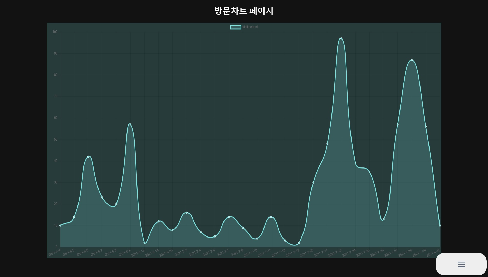
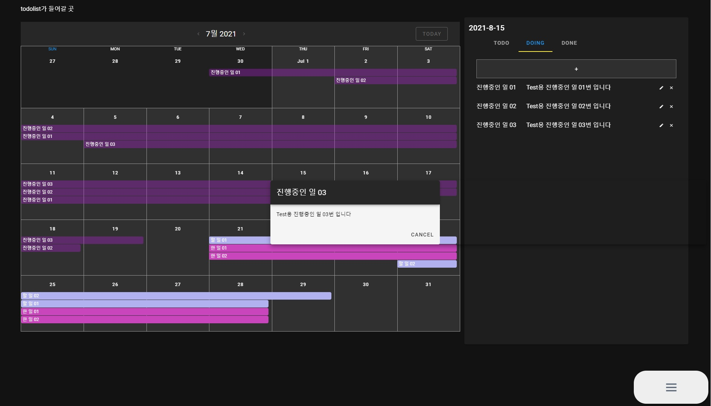
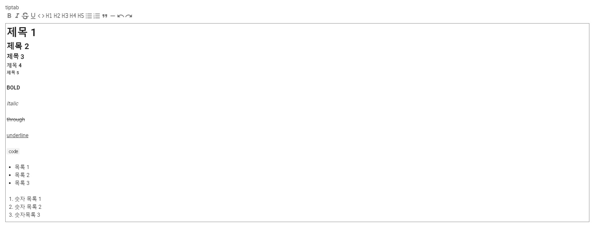
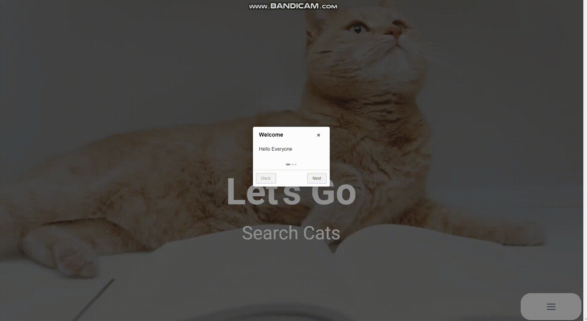
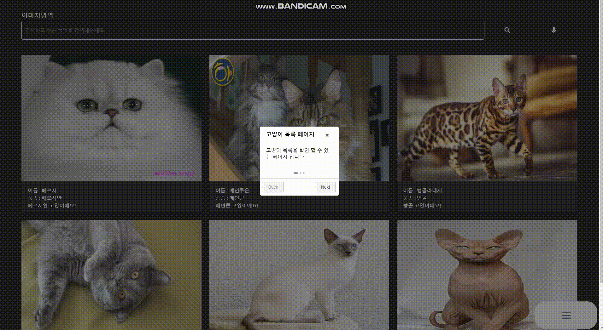
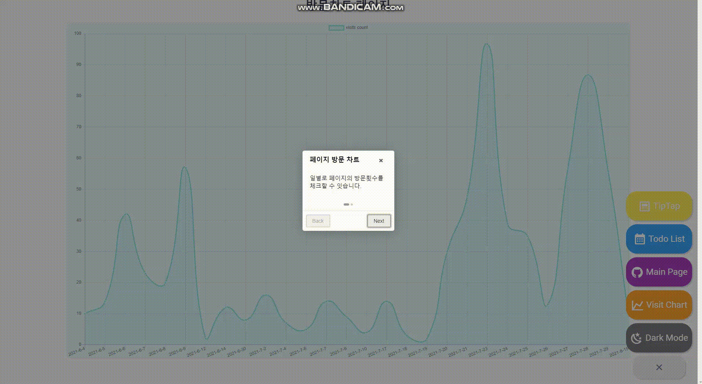
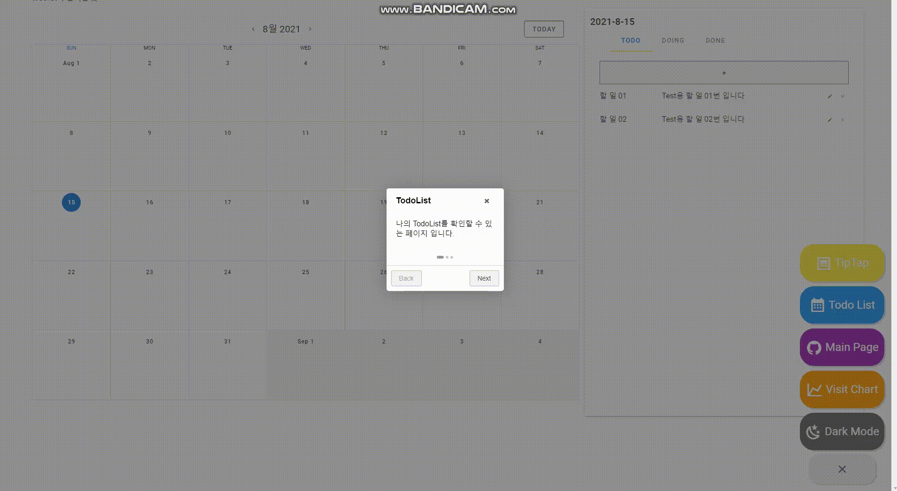

# CatList

**Notion** : 


**Front : Vue -> React** 

```
npm install
npm run start
```

**Back : Spring -> Node**

```
npm install
npm run start
```

<Strong>DB : mysql</strong>


## 개발 배경

**before**

시작은 무한스크롤을 Vue에서 적용해보기 위한 예제.

이제는 추가해보고 싶은 새로운 기능이나 라이브러리등을 하나씩 Vue에 적용해보기 위해 작성해보는 <br/>
개인 공부용 프로젝트.


**after**

React로 마이그레이션 하며, React에서 라이브러리의 적용과 React & Redux의 이해하기위해 연습하는 개인 공부용 프로젝트.


## 주요기능

* 무한 스크롤
* 고양이 detail정보
* 데이터 로딩 UI (Spinner)
* 검색기능
* 검색 후 최근 검색어 태그 추가
* 성격 차트
* 위치 지도 출력.
* 음성인식으로 검색창 입력 -> 가상키보드를 이용한 검색창 입력
* TodoList
* TipTap


## 실행화면

### Opening Page


### 목록 페이지

### 무한 스크롤 및 로딩 UI


### 구글 지도 확인 및 Detail Card


### 검색 및 검색어 태그상자 추가




## 메뉴

### 현재 메뉴 (리스트)


### 이전 메뉴 (원형)




## 다크모드


## 방문차트




## TodoList




## TipTap




## Intro Page

### Opening 페이지 Intro




### 목록 페이지 Intro




### 방문 차트 페이지 Intro




### TodoList 페이지 Intro



